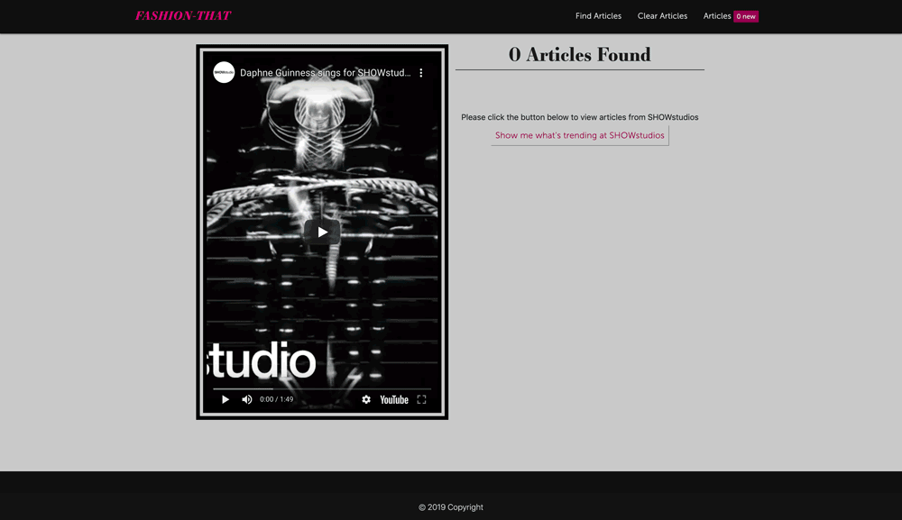

 
# Welcome to FASHION-THAT!

#### FASHION-THAT is a web application that allows Fashion enthusiasts to review the latest articles from SHOWstudios'. Utilizing an i-frame users can now view articles and take notes all in one place without ever leaving the browser window (although that option is provided as well).

---

## Table of Contents
  * [Technologies](#technologies)
  * [Features And Functionality](#features-and-functionality)
  * [File Architecture](#file-architecture)
  * [Click here to visit the site!](https://bloodcurdling-flesh-78620.herokuapp.com)
---

## Technologies
> <b>Design Tools:</b>
  * Adobe Photoshop
  
> <b>Development Tools:</b>
  * <b>Framework:</b> Materialize 
  * Express 
  * Express-handlebars 
  * Axios
  * Cheerio
  * Mongojs
  * Mongoose
  * Morgan
  * Node 
  * MLab MongoDB
  * Heroku
---

## Features And Functionality
* Demo Video 
     
---

## File Architecture

<b>Click To View</b>

         
         Fashion That 
         ├── Controllers
         │   └── appController.js
         ├── models
         │   ├── articles.js
         │   ├── index.js
         │   └── notes.js
         ├── public
         │   └── assets
         │       ├── css
         │       │   ├── materialize.css
         │       │   ├── materialize.min.css
         │       │   ├── reset.css
         │       │   └── style.css
         │       ├── images
         │       ├── js
         │       │   ├── articles.js
         │       │   ├── custom.js
         │       │   └── jquery.twbsPagination.min.js
         │       └── materialize.js
         │           ├── materialize.js
         │           └── materialize.min.js
         ├── routing
         │       ├── api_routes.js
         │       └── html_routes.js
         ├── views
         │       ├── layouts
         │       │   └── main.handlebars
         │       ├── partials
         │       │   ├── modal_clear_data.handlebars
         │       │   ├── footer.handlebars
         │       │   └── top_nav.handlebars
         │       └── index.handlebars
         ├── node_modules
         ├── readme_assets
         ├── .gitignore
         ├── package.json
         ├── README.md
         └── server.js

---

[Back To Top](#welcome-to-fashion-that)

